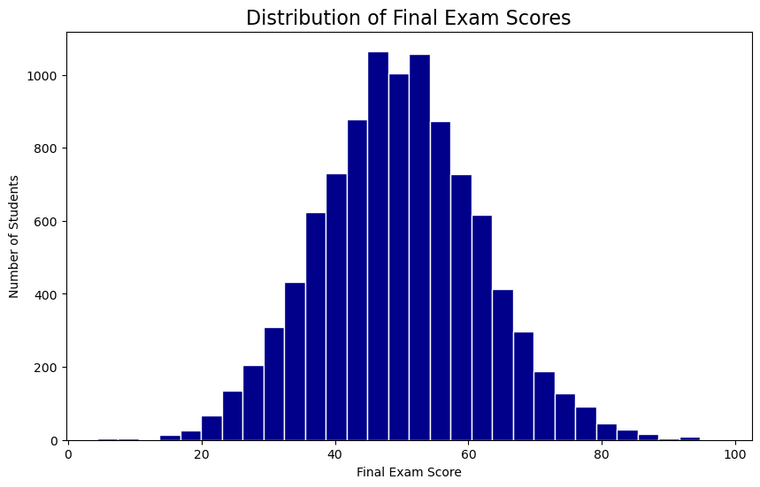
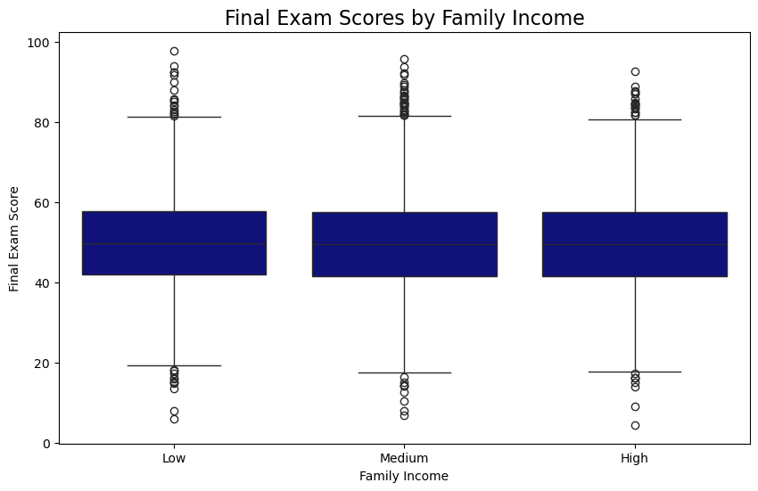
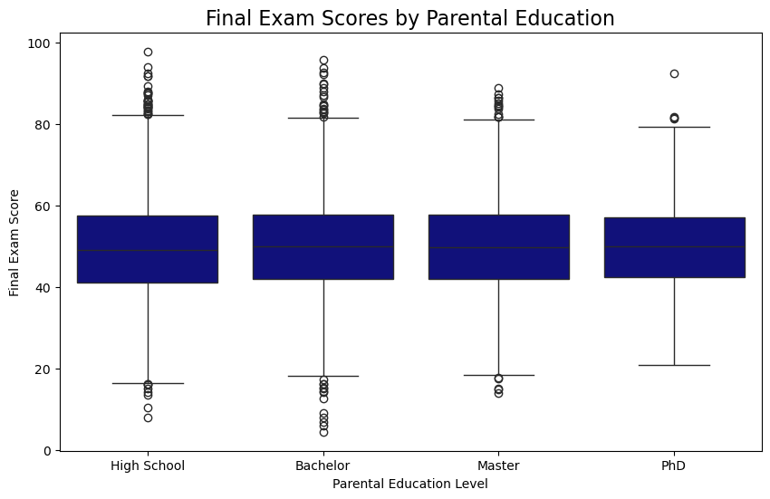
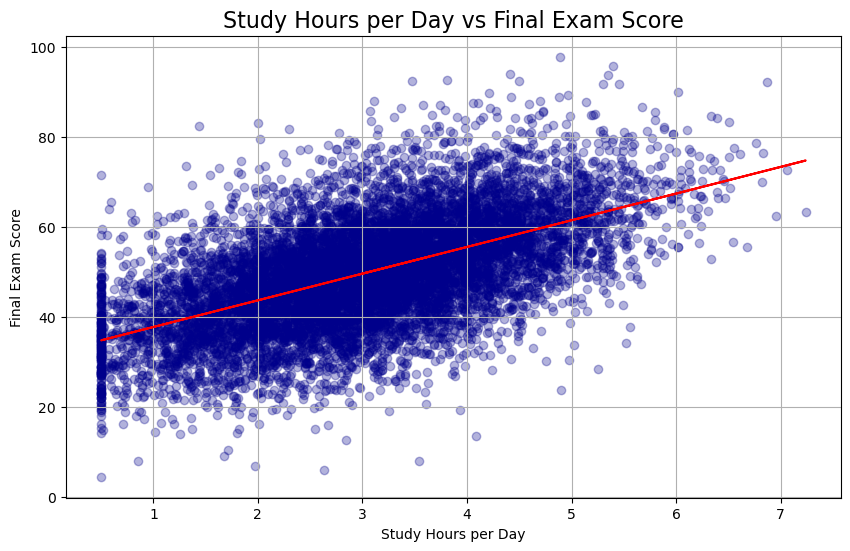
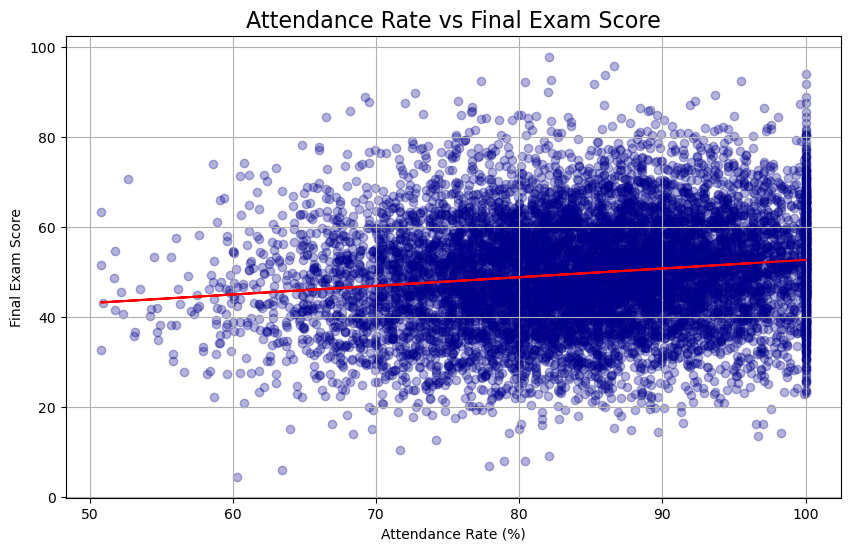
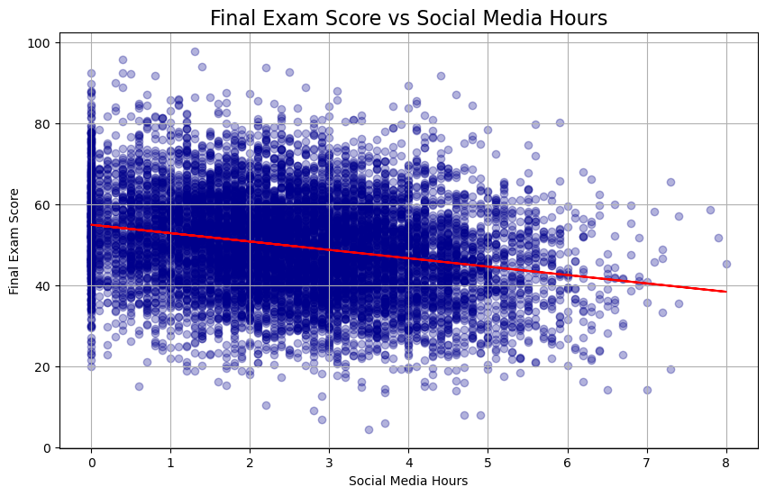

## Data Cleaning


```python
import pandas as pd

df = pd.read_csv('../data/student_exam_performance_dataset.csv')
print(df.shape)
print(df.head())
```

    (10000, 23)
      student_id  gender  age parental_education family_income internet_access  \
    0     S00001    Male   17        High School        Medium             Yes   
    1     S00002  Female   18        High School           Low             Yes   
    2     S00003    Male   17        High School        Medium              No   
    3     S00004    Male   18           Bachelor        Medium             Yes   
    4     S00005    Male   18           Bachelor        Medium             Yes   
    
      study_environment  study_hours_per_day  attendance_rate  sleep_hours  ...  \
    0             Quiet                 2.98             96.5         6.05  ...   
    1             Quiet                 4.45             95.7         6.96  ...   
    2             Quiet                 3.75             76.0         7.02  ...   
    3             Quiet                 2.03             72.6         6.23  ...   
    4             Quiet                 5.14             87.3         8.54  ...   
    
       online_courses_completed  tutoring  math_score  reading_score  \
    0                         1       Yes        42.8           62.4   
    1                         0       Yes        77.9           73.5   
    2                         4       Yes        53.5           38.3   
    3                         4        No        28.3           23.5   
    4                         0        No        74.7           54.9   
    
      writing_score  science_score  final_exam_score  previous_gpa  pass_fail  \
    0          54.8           51.8              49.1          2.44       Fail   
    1          64.4           61.6              70.1          2.79       Pass   
    2          36.3           47.1              42.2          1.49       Fail   
    3          32.0           39.0              31.9          1.34       Fail   
    4          73.6           55.5              66.4          2.60       Pass   
    
       grade_category  
    0               F  
    1               C  
    2               F  
    3               F  
    4               C  
    
    [5 rows x 23 columns]
    


```python
print(df.isnull().sum())
print(df.dtypes)
```

    student_id                    0
    gender                        0
    age                           0
    parental_education            0
    family_income                 0
    internet_access               0
    study_environment             0
    study_hours_per_day           0
    attendance_rate               0
    sleep_hours                   0
    social_media_hours            0
    assignment_completion_rate    0
    participation_score           0
    online_courses_completed      0
    tutoring                      0
    math_score                    0
    reading_score                 0
    writing_score                 0
    science_score                 0
    final_exam_score              0
    previous_gpa                  0
    pass_fail                     0
    grade_category                0
    dtype: int64
    student_id                     object
    gender                         object
    age                             int64
    parental_education             object
    family_income                  object
    internet_access                object
    study_environment              object
    study_hours_per_day           float64
    attendance_rate               float64
    sleep_hours                   float64
    social_media_hours            float64
    assignment_completion_rate    float64
    participation_score           float64
    online_courses_completed        int64
    tutoring                       object
    math_score                    float64
    reading_score                 float64
    writing_score                 float64
    science_score                 float64
    final_exam_score              float64
    previous_gpa                  float64
    pass_fail                      object
    grade_category                 object
    dtype: object
    


```python
print(df.duplicated().sum())
```

    0
    

# What Really Determines Student Exam Performance?
### A Data-Driven Analysis of 10,000 Students

There are many predictors which can be used to determine future academic success, most stemming from either a student's background or the amount of effort they put in, such as family income or the amount of hours studied, both of which I will cover in this blog. I aim to see which of these groups and variables contribute the most to a student's final exam scores. 

In this blog, I will analyse a dataset of 10,000 students to see what really drives exam performance.


## The Dataset

The data used in this blog is from Kaggle, titled "Student Exam Performance Dataset" and it can be found through this link: https://www.kaggle.com/datasets/ssssws/student-exam-performance-dataset?resource=download. It contains information from 10,000 students on 23 variables, covering 3 categories. The first category is background factors, containing variables such as: parental education, family income and gender. The second category is effort and habits, containing variables like: study hours per day, sleep hours and attendance rate. The final category is academic outcome, including variables: maths, reading and writing scores and final exam scores. 

The table below summarises a few key numerical statistics which will be used in the analysis. I have chosen these variables specifically as I believe them to be the strongest predictors of final exam score and best represent how much effort a student puts into achieving a high final exam score, especially "Study Hours per Day". The other two variables I am choosing, "Family Income" and "Parental Education" are being chosen to best represent a student's background.


```python
df[['study_hours_per_day', 'attendance_rate', 'sleep_hours', 
    'social_media_hours', 'final_exam_score']].describe().round(2)
```


<div>
<style scoped>
    .dataframe tbody tr th:only-of-type {
        vertical-align: middle;
    }

    .dataframe tbody tr th {
        vertical-align: top;
    }

    .dataframe thead th {
        text-align: right;
    }
</style>
<table border="1" class="dataframe">
  <thead>
    <tr style="text-align: right;">
      <th></th>
      <th>study_hours_per_day</th>
      <th>attendance_rate</th>
      <th>sleep_hours</th>
      <th>social_media_hours</th>
      <th>final_exam_score</th>
    </tr>
  </thead>
  <tbody>
    <tr>
      <th>count</th>
      <td>10000.00</td>
      <td>10000.00</td>
      <td>10000.00</td>
      <td>10000.00</td>
      <td>10000.00</td>
    </tr>
    <tr>
      <th>mean</th>
      <td>3.02</td>
      <td>84.70</td>
      <td>7.02</td>
      <td>2.52</td>
      <td>49.68</td>
    </tr>
    <tr>
      <th>std</th>
      <td>1.18</td>
      <td>9.51</td>
      <td>0.99</td>
      <td>1.45</td>
      <td>12.15</td>
    </tr>
    <tr>
      <th>min</th>
      <td>0.50</td>
      <td>50.80</td>
      <td>4.00</td>
      <td>0.00</td>
      <td>4.40</td>
    </tr>
    <tr>
      <th>25%</th>
      <td>2.20</td>
      <td>78.28</td>
      <td>6.34</td>
      <td>1.50</td>
      <td>41.60</td>
    </tr>
    <tr>
      <th>50%</th>
      <td>3.01</td>
      <td>85.10</td>
      <td>7.03</td>
      <td>2.50</td>
      <td>49.55</td>
    </tr>
    <tr>
      <th>75%</th>
      <td>3.83</td>
      <td>91.90</td>
      <td>7.69</td>
      <td>3.50</td>
      <td>57.60</td>
    </tr>
    <tr>
      <th>max</th>
      <td>7.24</td>
      <td>100.00</td>
      <td>10.00</td>
      <td>8.00</td>
      <td>97.80</td>
    </tr>
  </tbody>
</table>
</div>


## How did students perform overall?

Before exploring what predicts exam scores it would be useful to understand how students performed. The histogram below will visualise the distribution of results from the 10,000 students.


```python
import matplotlib.pyplot as plt

plt.figure(figsize=(10, 6))
plt.hist(df['final_exam_score'], bins=30, color='darkblue', edgecolor='white')
plt.title('Distribution of Final Exam Scores', fontsize=16)
plt.xlabel('Final Exam Score')
plt.ylabel('Number of Students')
plt.show()
```


    

    


Fig 1 - Histrogram of Final Exam Scores

This graph shows that scores are roughly normally distributed, with most scoring between 40-60 and few students are achieving in the extremes, 80+ and 0-20. 

## Does family background matter?

Now lets look into how family background affects final exam scores by comparing related variables with the final exam results. First we will look at family income.


```python
import seaborn as sns

plt.figure(figsize=(10, 6))
sns.boxplot(data=df, x='family_income', y='final_exam_score', 
            order=['Low', 'Medium', 'High'], color='darkblue')
plt.title('Final Exam Scores by Family Income', fontsize=16)
plt.xlabel('Family Income')
plt.ylabel('Final Exam Score')
plt.show()
```


    

    


Fig 2 - Box plot of Family Income against Final Exam Score

This graph shows that there really is not much difference in median exam scores, with all around the 50 mark. There is also a similar spread of results with the interquartile range being similar across all of the different groups.This suggests that family income has little to no effect on final exam scores. 

Next we will look at if parental education has any effect on exam results.


```python
plt.figure(figsize=(10, 6))
sns.boxplot(data=df, x='parental_education', y='final_exam_score',
            order=['High School', 'Bachelor', 'Master', 'PhD'],
            color='darkblue')
plt.title('Final Exam Scores by Parental Education', fontsize=16)
plt.xlabel('Parental Education Level')
plt.ylabel('Final Exam Score')
plt.show()
```


    

    


Fig 3 - Boxplot of Parental Education Level against Final Exam Score

The above graph also shows little to no difference in median scores, again all around the 50 mark. This shows that parental education level has a negligible effect on students' final exam scores. 

Both of the previous two graphs suggest that background has almost no effect on a student's results. So, now we will look at how much effort these students are putting into improving their grades and seeing if this has a greater effect. 

## Does effort matter?

After looking at 2 key indicators to a student's background and how that can affect their exam results we will now work on whether or not their effort has any effect on their final exam results. First, we will look at how study hours per day has an effect on final exam score and then we will look at attendance rate.


```python
import numpy as np

x_values = df['study_hours_per_day']
y_values = df['final_exam_score']

plt.figure(figsize=(10, 6))
plt.scatter(x_values, y_values, alpha=0.3, color='darkblue')
m, b = np.polyfit(x_values, y_values, 1)
plt.plot(x_values, m * x_values + b, color='red')
plt.title('Study Hours per Day vs Final Exam Score', fontsize=16)
plt.xlabel('Study Hours per Day')
plt.ylabel('Final Exam Score')
plt.grid(True)
plt.show()
```


    

    


Fig 4 - Scatterplot of Study Hours per Day against Final Exam Score

Here you can clearly see a positive correlation between study hours per day and final exam score, implying that the more a student is studying the greater their final exam result will be.

Now, we will visualise attendance rate against final exam results to see if this form of effort also has a positive correlation. 


```python
x_values = df['attendance_rate']
y_values = df['final_exam_score']

plt.figure(figsize=(10, 6))
plt.scatter(x_values, y_values, alpha=0.3, color='darkblue')
m, b = np.polyfit(x_values, y_values, 1)
plt.plot(x_values, m * x_values + b, color='red')
plt.title('Attendance Rate vs Final Exam Score', fontsize=16)
plt.xlabel('Attendance Rate (%)')
plt.ylabel('Final Exam Score')
plt.grid(True)
plt.show()
```


    

    


Fig 5 - Scatterplot of Attendance Rate against Final Exam Score

Here there is also a weak positive correlation, but still positive, between attendance rate and final exam score, suggesting that as attendance rate increases as will final exam score. It also cuts off at 50% attendance rate as no student had below that percentage. Next I will see how the variable "Social Media Hours" affects final exam scores.


```python
x_values = df['social_media_hours']
y_values = df['final_exam_score']

plt.figure(figsize=(10, 6))
plt.scatter(x_values, y_values, alpha=0.3, color='darkblue')
m, b = np.polyfit(x_values, y_values, 1)
plt.plot(x_values, m * x_values + b, color='red')
plt.title('Final Exam Score vs Social Media Hours', fontsize=16)
plt.xlabel('Social Media Hours')
plt.ylabel('Final Exam Score')
plt.grid(True)
plt.show()
```


    

    


Fig 6 - Scatterplot of Social Media Hours against Final Exam Score

By looking at the graph above there is a weak negative correlation between social media hours and final exam results. This shows that students who spend more time on their screens will receive lower final grades for every hour more than those who do not. 

## Regression Analysis

We have now visualised our data and it has begin to paint a picture that effort matters more than a student's background as to their final exam score. However, now we will use regression analysis to further confirm my findings as well as find out which individual factors are the strongest cause of higher exam results. Before we continue with the regression analysis I have to convert family income and parental education into numerical variables with each level being given an increasing numerical equivalent.


```python
import statsmodels.api as sm

# Convert family_income to numbers
df['family_income_coded'] = df['family_income'].map({'Low': 0, 'Medium': 1, 'High': 2})

# Convert parental_education to numbers
df['parental_education_coded'] = df['parental_education'].map(
    {'High School': 0, 'Bachelor': 1, 'Master': 2, 'PhD': 3})

# Check it worked
print(df[['family_income', 'family_income_coded', 
          'parental_education', 'parental_education_coded']].head())
```

      family_income  family_income_coded parental_education  \
    0        Medium                    1        High School   
    1           Low                    0        High School   
    2        Medium                    1        High School   
    3        Medium                    1           Bachelor   
    4        Medium                    1           Bachelor   
    
       parental_education_coded  
    0                         0  
    1                         0  
    2                         0  
    3                         1  
    4                         1  
    


```python
# Define our variables
X = df[['study_hours_per_day', 'attendance_rate', 'sleep_hours', 
        'social_media_hours', 'family_income_coded', 'parental_education_coded']]
y = df['final_exam_score']

# Add a constant
X = sm.add_constant(X)

# Run the regression
model = sm.OLS(y, X).fit()
print(model.summary())
```

                                OLS Regression Results                            
    ==============================================================================
    Dep. Variable:       final_exam_score   R-squared:                       0.419
    Model:                            OLS   Adj. R-squared:                  0.419
    Method:                 Least Squares   F-statistic:                     1201.
    Date:                Sun, 03 May 2026   Prob (F-statistic):               0.00
    Time:                        15:02:15   Log-Likelihood:                -36447.
    No. Observations:               10000   AIC:                         7.291e+04
    Df Residuals:                    9993   BIC:                         7.296e+04
    Df Model:                           6                                         
    Covariance Type:            nonrobust                                         
    ============================================================================================
                                   coef    std err          t      P>|t|      [0.025      0.975]
    --------------------------------------------------------------------------------------------
    const                       17.8682      1.107     16.140      0.000      15.698      20.038
    study_hours_per_day          5.9515      0.079     75.740      0.000       5.797       6.106
    attendance_rate              0.2014      0.010     20.663      0.000       0.182       0.220
    sleep_hours                  0.2762      0.093      2.956      0.003       0.093       0.459
    social_media_hours          -2.1120      0.064    -32.975      0.000      -2.238      -1.986
    family_income_coded          0.0871      0.133      0.653      0.513      -0.174       0.349
    parental_education_coded     0.0947      0.104      0.914      0.361      -0.108       0.298
    ==============================================================================
    Omnibus:                      164.090   Durbin-Watson:                   1.969
    Prob(Omnibus):                  0.000   Jarque-Bera (JB):              240.193
    Skew:                           0.189   Prob(JB):                     6.96e-53
    Kurtosis:                       3.659   Cond. No.                     1.02e+03
    ==============================================================================
    
    Notes:
    [1] Standard Errors assume that the covariance matrix of the errors is correctly specified.
    [2] The condition number is large, 1.02e+03. This might indicate that there are
    strong multicollinearity or other numerical problems.
    

This provides us many key findings, the first of which being an R-squared value of 0.419, meaning that 41.9% of variation in  final exam score is determined by these 6 variables, however it does mean that 58.1% of variation is affected by other factors suggesting that final exam scores are not simply determined by effort or background. This means that these variables are very important in determining how well a student will perform, however some variables have a much greater effect than others. Family income and parental education both have coefficients less than 0.1 meaning for each level they go up, either a higher level of income or a higher level of education, their final exam score goes up by less than 0.1. Unlike these variables, study hours per day has a coefficient of 5.95, meaning that for each extra hour their final result will increase by 6, which is very important to their overall score. Also, family income and parental education have p-values of 0.513 and 0.361, respectively, meaning that they are not statistically significant at 5% significance level which backs up what we saw in the boxplots, family background simply has no meaningful impact on final exam results. However, the other 4 variables are all below this threshold meaning that they are statistically significant. 

## Limitations

There are several limitations to this dataset, the first of which being that correlation does not mean causation. Just because those who study more does not guarantee they will achieve higher grades than those who do not due to the effects of other variables. This leads me on to the next limitation, missing variables. 58.1% of variation is explained by variables which are not in the data set, such as IQ or whether or not a student is an athlete or not. These other factors could have a greater impact on results than effort or a student's background. The final limitation I have is that much of the data, specifically the variables to do with effort are self reported, meaning that the results could be skewed as the data is not being accurately reported.

## Conclusion

After conducting my my analysis into the question 'What really determines student exam performance?' there is a clear answer being presented by my findings. Despite people often crediting family background, either education or income, the data shows that it had no statistically significant impact on exam results, with students from low income families performing just as well as those from high income families or even having parents with a PhD having almost no difference to those with parents with just a High School education. 

What really made the difference was the amount of effort the student themselves made, with study hours per day being the best predictor of a student's exam performance, with 1 extra hour of study being rewarded with nearly 6 more marks on the final exam. Other notable predictors were sleep and social media usage, with social media having a negative impact on exam results whilst sleep was positive. 

The results are clear, it does not matter what sort of background a student has, it matters how much you work towards your exams. So, instead of giving up because you think other student's have it naturally easier, you should study more, sleep more and put the phone down. 


```python
import nbformat

with open('blog.ipynb', 'r', encoding='utf-8') as f:
    nb = nbformat.read(f, as_version=4)

word_count = 0
for cell in nb.cells:
    if cell.cell_type == 'markdown':
        words = len(cell.source.split())
        word_count += words

print(f"Markdown word count: {word_count}")
```

    Markdown word count: 1425
    
